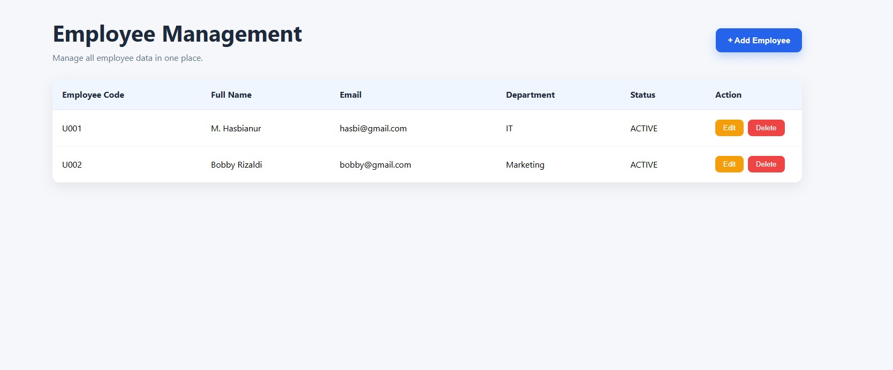
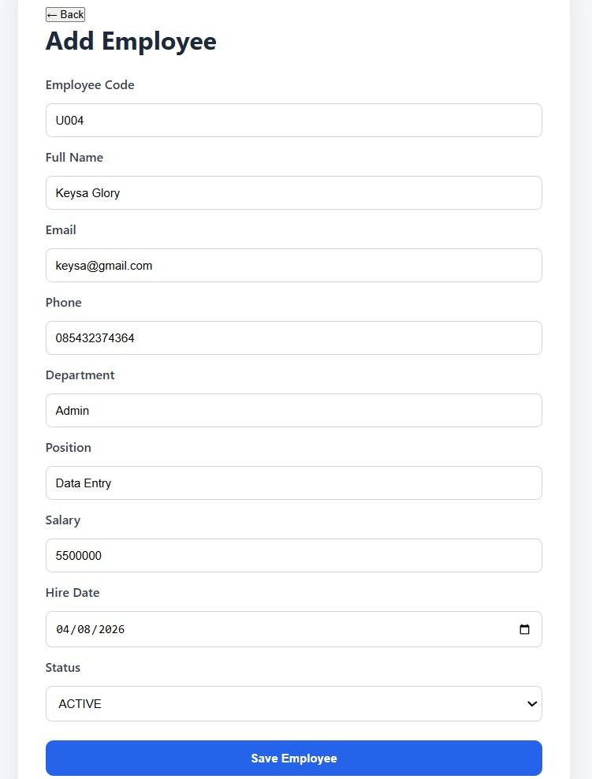
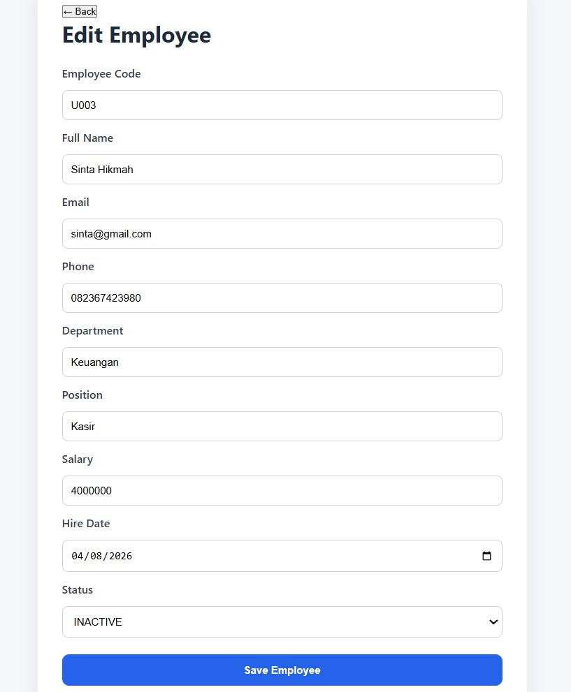
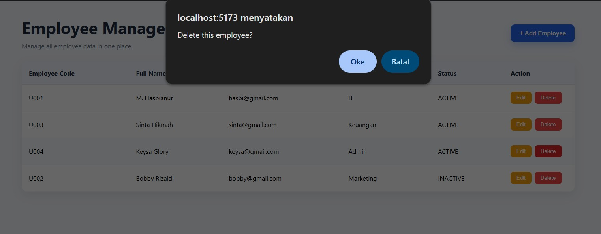
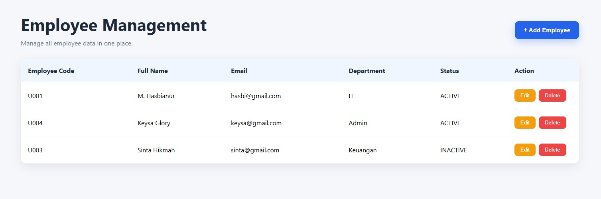
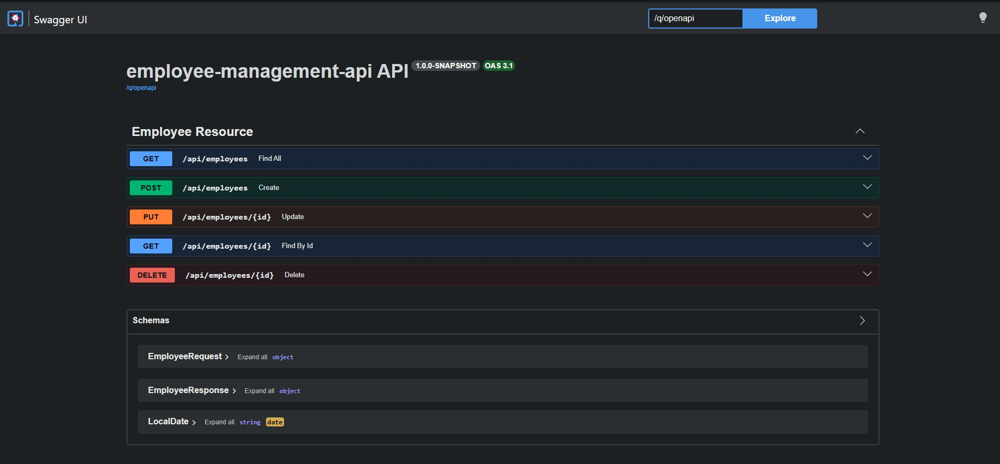

# Employee Management System

A modern **Full Stack Employee Management System** built using **Quarkus** and **React**. This application provides complete employee management features with RESTful API integration and a responsive React frontend.

---

## Features

- ✅ Create Employee
- ✅ Read Employee
- ✅ Update Employee
- ✅ Delete Employee
- ✅ Form Validation
- ✅ Exception Handling
- ✅ REST API
- ✅ Swagger API Documentation

---

# 🖼 Application Preview

## 📋 Employee List



---

## ➕ Add Employee



---

## ✏️ Edit Employee



---

## 🗑 Delete Employee



---

## 🔄 Employee List (Updated)



---

## 📚 Swagger API



---

# 🛠 Tech Stack

## Backend

- Java 21
- Quarkus
- Hibernate ORM (Panache)
- PostgreSQL
- Jakarta Validation
- REST API

## Frontend

- React
- TypeScript
- Vite
- Axios
- React Router

---

# 📂 Project Structure

```text
employee-management-quarkus
│
├── backend
│   └── employee-management-api
│
├── frontend
│
├── screenshots
│   ├── add-employee.jpg
│   ├── delete-employee.jpg
│   ├── edit-employee.jpg
│   ├── employee-list.jpg
│   ├── employee-list-update.jpg
│   └── swagger-api.jpg
│
├── .gitignore
└── README.md
```

---

# 🚀 Getting Started

## Clone Repository

```bash
git clone https://github.com/MHASBIANUR/employee-management-quarkus.git
```

---

## Backend

```bash
cd backend/employee-management-api

mvn quarkus:dev
```

Backend runs at

```
http://localhost:8080
```

Swagger UI

```
http://localhost:8080/q/swagger-ui
```

---

## Frontend

```bash
cd frontend

npm install

npm run dev
```

Frontend runs at

```
http://localhost:5173
```

---

# 📌 REST API

| Method | Endpoint | Description |
|---------|----------|-------------|
| GET | `/employees` | Get All Employees |
| GET | `/employees/{id}` | Get Employee by ID |
| POST | `/employees` | Create Employee |
| PUT | `/employees/{id}` | Update Employee |
| DELETE | `/employees/{id}` | Delete Employee |

---

# 👨‍💻 Author

**M. Hasbianur**

GitHub:
https://github.com/MHASBIANUR

LinkedIn:
https://linkedin.com/in/m-hasbianur
